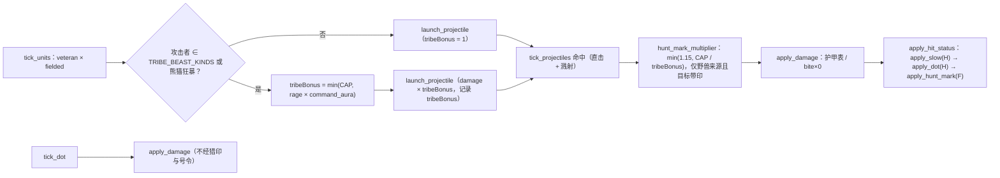

# 设计文档：原始部落重设计（tribe-faction-redesign）

> 流程：design-first。已有本文与由本文派生的 requirements.md（各 Correctness Property 的 Validates 指向其编号），尚无 tasks.md。文中「决策 A–K」「问题 1–8」沿用立项说明的编号，「已确认决策 1–4」见文末。
> 语言约定：正文中文，代码标识符、字段名、文件路径保持英文。所有数值以 `catalog.py` 为唯一来源，客户端只读 `public_catalog()` 下发的字段。

## Overview

### 目标

在不改地图、不加依赖、不加自爆、不做超远程炮的前提下，让原始部落（`faction=tribe`）在祭坛前就有反甲手段、塔能守住单辆坦克、祭坛能养野兽、驯兽师在无中立地图上也有价值，并补齐营地反甲步兵与后期攻城；同时把全部部落单位纳入近景美术管线，统一石器风格、队色与动画。

### 现状核实（动笔前逐条对照代码）

| 立项描述 | 代码事实（文件） | 结论 |
|---|---|---|
| 对重甲 DPS：投石≈7.9、骨矛≈7.2、火箭兵≈47.5、法师≈61 | 26×0.35/1.15=7.91；14×0.35/0.68=7.21；38×1.5/1.2=47.5；42×1.6/1.1=61.1（`catalog.py`、`server.DAMAGE_MULTIPLIER`） | 属实 |
| 四只进阶兽 requires taltar；战狼 bite 对轻/重甲、建筑 ×0 且不索敌载具 | `spider/scorpion/mammoth/panda.requires=["taltar"]`；`tick_units` 对 dog/wolf 用 `nearest_enemy_infantry`，`is_dog_prey` 排除 `VEHICLE_KINDS` | 属实 |
| 棘矛哨塔≈19 DPS/195；毒矢高台含 DoT≈17/275；导弹 75、雷暴≈83/420 | 40×0.35/0.72=19.4；24×0.55/1.3+12×0.55=16.8；120/1.6=75；70×1.3/1.1=82.7 | 属实 |
| 维修只认 VEHICLE_KINDS；该集合还用于扑咬 ×0、is_dog_prey、BOT_SCOUT_VEHICLES、bot 送修 | `issue_repair`、`apply_damage`、`hold_target_valid`、`is_dog_prey`、`BOT_SCOUT_VEHICLES`、`tick_bots` 送修、`public_catalog().repairable`；**另有** `ai_commander/commander.py::_repair` 与 `ai_commander/codex.py::counter` 也读它。`tick_repair_unit` 本身**不检查** kind | 属实，影响面比描述多 2 处（见偏差） |
| 五车争霸、裂谷旷野无中立；中立营 2 突击兵 + 1 火箭兵 | `central_scramble` 与 `rift_map` 均 `neutralOreGuards: False`；`start_game` 写 `game["neutrals"] = 房间开关 and 地图开关`；`spawn_neutral_ore_camp` 生成 rifle×2 + rocket + turret | 属实（炮塔不可驯） |
| bot 不看中立就带 tamer；按存量最少优先；inbound 带 tamer | `bot_support_choices`/`bot_unit_choices`（defend/late/inbound）与 `bot_queue_unit` 的 late 列表都含 tamer；`bot_try_choices` 按 `bot_kind_stock` 升序 | 属实 |
| 作战单位 8 / 13 / 12 | 部落 spear、tamer、wolf、spider、scorpion、mammoth、panda、slinger | 属实 |
| 巨蛛冷却 1.45 < 定身 2.2；减速/DoT 后写覆盖；测试断言「后手冰霜覆盖定身」 | `apply_slow`/`apply_dot` 直接覆写；`tribe_spider_test` Test 7 | 属实 |
| 开局守军 | `start_game`：3×`loadout["infantry"]` + 1×`loadout["armor"]`，仅非 `packedStart` 地图。运行时只有 `start_game` 读 `["infantry"]`/`["armor"]`（另有 `tests/tribe_test.py` 断言）；`ensure_starting_command`、精炼厂赠车、`tests/battle_report_visual_server.py`、`tests/central_scramble_test.py` 只读 hq/power/refinery/harvester/mcv；客户端、ai_commander、README 不读装备表；bot 开局推进阈值 `BOT_ARMY_PUSH = 3` | 属实（五车/裂谷只发基地车） |
| 近景管线 | `RIVER_ART_KINDS`={tank, overlord, overlord_v1, overlord_v2, dragon, rifle, mage}；rig 仅 `walk`/`wing`，轴只有 x/z；每 rig 每兵种一个 InstancedMesh；`riverStructureDetails` 返回的零件**整体替换**基础 `structureParts`，`aBreak` 由 `structureGeometries` 的 `mergeParts(...,{fracture:true})` 统一烘焙 | 属实 |
| 材质 | `bakeRiverSurfaceData` 2×2 图集 512²；kind 3 为错行圆鼓包（即巨龙鳞片）；部落野兽现走 `SURF.hide=3`，近景样板下就是鳞片 | 属实，兽毛需另做 |

### 方案总览

| 决策 | 内容 | 解决问题 |
|---|---|---|
| A | 新单位燧石标枪手 `javelin`（营地反甲步兵，rocket 伤种，无溅射） | 1、5 |
| B | 巨蝎 `requires=[]`，hp 250，range 165（已确认决策 2） | 1 |
| C | 棘矛哨塔改 shell 中距（便宜一档）；毒矢高台直伤改 ap、DoT 仍 venom、溅射挂毒（已确认决策 1）；兽夹 2 次充能 | 2 |
| D | `REPAIRABLE_KINDS = VEHICLE_KINDS ∪ TRIBE_BEAST_KINDS`，只替换维修相关判断 | 3 |
| E | 驯兽师 hp 90 + 驯兽号令光环；bot 驯兽师过滤与上限 | 4 |
| F | 标志机制「猎印」：猎手标记、野兽收割 | 1、4、5 |
| G | 新单位巨石投石车 `catapult`（祭坛后攻城，木制器械） | 5 |
| H | 跨阵营控制规则：减速/DoT 强者优先，定身不续时 + 1.0 s 抗性 | 7 |
| I | 开局守军改为 3 骨矛 + 1 标枪手 + 1 战狼（1310，钢铁 1320）；`FACTION_LOADOUT` 新增可选 `garrison`（已确认决策 3） | 8 |
| J | bot / ai_commander 接入新单位 | 4、5 |
| K | 确定性小规模交战回归 | 6 |
| 美术 | 部落单位全部进近景管线（新模块 `tribe_art_models.js`）、兽毛材质、建筑细节、特效与 HUD | 可玩性与建模美观 |

### 非目标

不加自爆；不做超远程炮（投石车 350 < 攻城炮以外的远程塔 360/420）；除规则 H 外不改钢铁/秘法数值；不改地图与中立营编制；不加 Python/JS 依赖；不生成新位图（只复用 `river-material-atlas-v1.png` 与既有烘焙图集）；远景 LOD（`simpleUnitParts`）既有部落条目不改。

### 离线估算（核实用，非验收）

首轮用当前引擎 + 内存中临时覆盖目录数值跑确定性交战（`FLAT_TERRAIN`、双方互相攻击移动、8 个种子；猎印按 ×1.15 近似、号令仅驯兽师存活时生效、未含规则 H 与封顶），结果仅用于给回归区间定初值，实现后必须重标定。已确认决策 1–3 采用的方案在首轮已作为备选估算过；第二轮未重跑，标「未重估」的行沿用被替换方案的数值。

| 场景（造价） | 结果 |
|---|---|
| 4 标枪手（1440）vs 1 坦克（780） | 全胜，剩余价值 78%，约 4.1 s；3 名全胜剩 58%；2 名全负，坦克剩 13% |
| 4 火箭兵（1360）vs 1 坦克（参照） | 全胜，剩 76% |
| 新棘矛哨塔 vs 1 坦克 / 2 坦克 | 塔胜剩 61% / 塔毁，坦克剩 30–40%（旧塔 vs 1 坦克：塔毁，坦克剩 55%；哨戒炮塔 vs 2 坦克：塔胜剩 31%） |
| 新毒矢高台 vs 1 坦克 / 6 突击兵 | 直伤 ap（采用）：塔胜剩约 59% / 塔胜剩约 77%。直伤 venom：塔毁，坦克剩 22–25% / 塔胜剩 85%。直伤 shell：单挑坦克险胜，塔剩约 10%。（6 突击兵参照：导弹塔 78%，雷暴塔 82–85%） |
| 棘矛+毒矢 vs 2 坦克 / 3 坦克 | 胜剩 48% / 负，坦克剩 32%（直伤 venom 时的估算，改 ap 后未重估；对重甲 DPS 由 24.4 升到 68.3，结果只会偏向塔方）（哨戒+导弹 vs 3 坦克胜剩 55%；奥术+雷暴胜剩 69%） |
| 巨蝎 vs 1 坦克；巨蝎+骨矛 vs 1 坦克 | 250/165（采用）：小胜，巨蝎剩约 8%；220/165：负，坦克剩 17%；旧 165/145：坦克剩 44%。巨蝎+骨矛：胜，剩 78%（220 时估算，250 未重估） |
| 早期 3 矛+2 标枪+2 狼（2050）vs 钢铁 3 步枪+2 火箭+1 坦克（2000） | 全胜，剩 43–45% |
| 同一部落编队 vs 秘法 3 晶刺+法师+傀儡（1950） | 全胜，剩 39–48% |
| 2 标枪+2 矛+2 蝎+驯兽师（3000）vs 3 坦克+2 步枪（2700） | 无猎印 1/8 胜；有猎印 4/8 胜（巨蝎 220 时估算，250 未重估） |
| 部落守军 vs 钢铁守军（3 步枪+坦克，1320） | 3 矛+标枪+狼（1310，采用）：胜，剩约 27%。3 矛+狼（950）：负，钢铁剩 44%。3 矛+熊猫（1550）：胜，剩 39%。对秘法守军（2350）后两者均负（钢铁守军对秘法同样负），采用方案未估算 |
| 投石车 vs 哨戒炮塔 / 奥术塔 / 3 突击兵 | 23.7 s 零损拆塔（攻城炮 24.0 s）/ 被打掉（射程 360 > 350）/ 负，步兵剩 59%（攻城炮 36%） |

巨蝎穿甲刺对坦克 172.2：4 刺才杀 620 血；猎印单独 ×1.15 仍 4 刺（594）；猎印 + 号令 ×1.265 = 217.8，3 刺（653）即杀。这是「猎手挂印 + 驯兽师号令」组合的可读收益点。反过来，坦克炮对巨蝎 57.8/发：hp 250 要 5 发（4 发 231.2），巨蝎单挑的胜负取决于最后一发的时序，回归按均势区间断言。

## Architecture

### 模块边界

| 层 | 文件 | 职责 |
|---|---|---|
| 数据 | `catalog.py` | 新单位、改动数值、新常量与集合、`FACTION_LOADOUT` 可选 `garrison` 与 `START_GARRISON_OFFSETS`/`faction_start_garrison`、`public_catalog()` 新字段 |
| 权威结算 | `server.py` | 状态计时、控制规则 H、猎印、驯兽号令与加成封顶、兽夹充能、维修集合、投石车索敌、开局守军落位、bot |
| AI 插件 | `ai_commander/templates.py`、`ai_commander/commander.py` | 部落模板、送修集合 |
| 渲染 | `public/tribe_art_models.js`（新）、`public/river_art_models.js`、`public/river_art_materials.js`、`public/render3d.js`、`public/battle_feedback.js` | 近景模型与 rig、兽毛、建筑细节、弹道与标记特效 |
| HUD | `public/app.js`、`public/index.html` | 文案、肖像、克制表 |
| 文档 | `README.md` | 部落段落与控制规则说明 |

### 伤害与状态结算管线



要点：攻方侧加成（狂暴、号令）在开火时确定并写进弹丸；目标侧加成（猎印）在命中时逐目标判定；封顶只作用于这三者连乘，军衔与 `fielded_combat_multiplier` 在其外。

### 下发与客户端

- 首帧静态目录（`PUBLIC_CATALOG`）新增：单位 `huntMark`、`commandAuraRadius`，建筑 `trapCharges`；`repairable` 改读 `REPAIRABLE_KINDS`。增量帧不重发目录。
- 每帧实体（已经过迷雾过滤）新增可选布尔：单位 `marked`、`rootResist`；陷阱 `charges`（整数）。只在为真/有值时写入，缺省不占字节。
- 客户端只用这些字段做表现：光环圈、爪痕标记、治疗微粒、文案，不参与任何判定。

### 改动文件一览

`catalog.py`、`server.py`、`ai_commander/templates.py`、`ai_commander/commander.py`、`public/tribe_art_models.js`（新）、`public/river_art_models.js`、`public/river_art_materials.js`、`public/render3d.js`、`public/battle_feedback.js`、`public/app.js`、`public/index.html`、`README.md`、`tests/visual_benchmark.html`，以及「Testing Strategy」列出的测试文件。

## Components and Interfaces

### 1 目录与常量（catalog.py）

#### 1.1 单位

| kind | 名称 | cost | hp | speed | damage | range | cd | projectile / 速度 | splash | damageType | armor | producer | requires | build | size | sight 基础→有效 |
|---|---|---|---|---|---|---|---|---|---|---|---|---|---|---|---|---|
| `javelin`（新） | 燧石标枪手 | 360 | 110 | 96 | 40 | 200 | 1.25 | `javelin` / 560 | 0 | rocket | infantry | tcamp | [] | 5 | 10.5 | 390→390 |
| `catapult`（新） | 巨石投石车 | 1000 | 340 | 48 | 95 | 350 | 2.4 | `megalith` / 240 | 60 | siege | light | tpen | [taltar] | 11 | 22 | 300→385 |
| `scorpion` | 穿甲巨蝎 | 820 | 165→**250** | 100 | 82 | 145→**165** | 1.80 | sting / 640 | 0 | ap | beast | tpen | [taltar]→**[]** | 7.5 | 13 | 390 |
| `tamer` | 驯兽师 | 260 | 70→**90** | 100 | 8 | 80 | 1.1 | bullet | 0 | bullet | infantry | tcamp | [] | 5 | 10 | 360 |

新增字段：`spear`/`slinger`/`javelin` 加 `"huntMark": True`；`tamer` 加 `"commandAura": {"radius": 220.0, "mult": 1.10}`。其余部落单位数值不变。

理由：

- 标枪手是钢铁火箭兵的部落对位：同档造价（+20）、+15 hp、−5 射程、无溅射。无溅射避免与投石猎手（溅射清步兵）重叠；110 hp 与突击兵同档，军犬一口仍死（bite 240），不做抗狗步兵。
- 巨蝎解锁提前到围栏，镜像歼击车（工厂即可产）。hp 250（已确认决策 2）让坦克需要 5 发 shell（57.8×4=231.2 < 250；旧 165 只需 3 发，220 需 4 发）；射程 165 缩小与坦克 180 的差距。估算单挑坦克小胜、巨蝎剩约 0.08（220 时坦克剩约 0.17），围栏阶段的投资不再必亏；但胜负取决于最后一发的时序，稳定换坦克仍要骨矛/标枪掩护，或「猎印 + 号令」把 4 刺降到 3 刺。血量仍低于除战狼（200）外的所有野兽（巨蛛 340、熊猫 860、猛犸 1280）与歼击车（400），保持玻璃大炮定位。
- 驯兽师 hp 90：多扛一发坦克炮（37.4×3），号令在交战中更容易存续；军犬仍一口死。
- 投石车对位攻城炮（960/300/340/85/2.2/55）：+10 射程压过哨戒炮塔 320 与棘矛哨塔 270，但打不过奥术塔 360、导弹塔/雷暴塔 420 与新毒矢高台 360；轻甲木制器械（子弹 ×0.65 比重甲 ×0.35 更怕步兵，穿甲 ×0.65 比重甲 ×2.10 更抗歼击），必须护送。弹速 240 与裂地晶兽相同，巨石弧线可见可躲。缺省字段补齐：`projectileSpeed=240`、`sight=300`（有效视野按射程 ×1.1 = 385）。投射物名 `megalith` 已核对未被占用（`boulder`/`rune_boulder`/`rock`/`meteor`/`siege` 均已占用）。

对各护甲 DPS（×倍率 ÷ 冷却）：

| 单位 | 步兵 | 轻甲 | 重甲 | 兽甲 | 魔导 | 建筑 |
|---|---|---|---|---|---|---|
| javelin | 24.0 | 41.6 | 48.0 | 35.2 | 32.0 | 27.2 |
| rocket（参照，另有 42 溅射） | 23.8 | 41.2 | 47.5 | 34.8 | 31.7 | 26.9 |
| scorpion | 11.4 | 29.6 | 95.7 | 25.1 | 45.6 | 31.9 |
| catapult | 9.9 | 11.9 | 9.9 | 11.9 | 39.6 | 71.3 |
| artillery（参照） | 9.7 | 11.6 | 9.7 | 11.6 | 38.6 | 69.5 |

#### 1.2 建筑

| kind | cost | hp | damage | range | cd | splash | 伤种 | 对重甲 DPS | 对步兵 DPS | 其他 |
|---|---|---|---|---|---|---|---|---|---|---|
| `tspiketower` 旧 | 720 | 820 | 40 | 195 | 0.72 | 16 | bullet | 19.4 | 55.6 | |
| `tspiketower` 新 | **800** | **1050** | **62** | **270** | **0.85** | **20** | **shell** | 72.9 | 40.1 | requires 不变 |
| `turret`（参照） | 950 | 1300 | 80 | 320 | 0.70 | 51 | shell | 114.3 | 62.9 | |
| `ttoxtower` 旧 | 1000 | 880 | 24 | 275 | 1.30 | 0 | venom | 16.8 | 35.0 | DoT 12×3.2 |
| `ttoxtower` 新 | **1100** | **1000** | **34** | **360** | **1.20** | **28** | **ap**（DoT venom） | 68.3 | 25.5 | DoT **16**×3.2（venom），溅射目标也挂毒；分护甲见下表 |
| `missile` / `mstorm`（参照） | 1200 | 1050 | 120 / 70 | 420 | 1.6 / 1.1 | 45 / 0 | shell / tesla | 75.0 / 82.7 | 41.3 / 50.9 | |
| `ttrap` | 320 | 140 | 75 | 半径 44 | — | — | shell | — | — | `trapExpire: False`、`trapCharges: 2`、`trapCooldown: 8.0`，定身 2.0 s |
| `tpit` | 不变 | | | | | | | | | |

毒矢高台对各护甲 DPS（单目标：直伤 34/1.20 × 伤种倍率 + DoT 16 × venom 倍率；冷却 1.20 s 短于 DoT 3.2 s，单目标的 DoT 不断档；DoT 不挂建筑）：

| 直伤伤种 | 步兵 | 轻甲 | 重甲 | 兽甲 | 魔导 | 建筑 |
|---|---|---|---|---|---|---|
| ap（采用） | 7.1+18.4=25.5 | 18.4+13.6=32.0 | 59.5+8.8=68.3 | 15.6+16.0=31.6 | 28.3+16.0=44.3 | 19.8 |
| venom（未采用） | 32.6+18.4=51.0 | 24.1+13.6=37.7 | 15.6+8.8=24.4 | 28.3+16.0=44.3 | 28.3+16.0=44.3 | 11.3 |

溅射半径 28 内的每名敌方单位另吃 34 × 0.45 × (1 − r/28) × 倍率的直伤，并挂上同样的 venom DoT（对步兵 18.4/s）。

理由：棘矛哨塔改为部落的中距反甲近防（shell 对重甲 1.0），对步兵下降到 40 DPS（由毒矢高台的溅射毒补位）；造价仍比哨戒/奥术塔低 150，定位「便宜一档」：守得住 1 辆坦克、守不住 2 辆（已确认决策 4）。毒矢高台直伤改 `ap`（已确认决策 1）：对重甲 59.5 + DoT 8.8 = 68.3 DPS，接近导弹塔 75.0，估算单挑 1 坦克塔胜、塔剩约 0.59（直伤 venom 时塔毁、坦克剩 22–25%）；DoT 仍 venom 16×3.2，溅射目标也挂毒，清步兵从直伤转为扩散的毒（单目标 25.5 DPS，其中 DoT 18.4），估算对 6 突击兵塔剩约 0.77（直伤 venom 时 0.85）。不用 `shell`：单挑坦克只险胜（塔剩约 0.10），且与棘矛哨塔同伤种。DoT 伤种由 `dot.damageType` 单独决定（`apply_dot` 读 `dot.get("damageType")`，`tick_dot` 按 `dotDamageType` 结算），改直伤伤种不影响 DoT。射程 360 + 自身尺寸，恰好压过攻城炮（340）与投石车（350）的攻击距离。溅射挂毒无需新代码——`tick_projectiles` 对溅射目标本就调用 `apply_hit_status`，只要 `splash>0`。兽夹单次触发成本 160，冷却 8 s 且受规则 H 抗性约束，不能连锁定身。

#### 1.3 集合与常量

```python
# catalog.py —— VEHICLE_KINDS 追加木制器械；其余三种用途（扑咬 ×0 / 猎物 / 侦察）继续只读 VEHICLE_KINDS
VEHICLE_KINDS = frozenset((..., "tharvester", "tmcv", "catapult"))

# 猎印（决策 F）与部落加成封顶
HUNT_MARK_SECONDS = 4.0
HUNT_MARK_BONUS = 1.15
TRIBE_BONUS_CAP = 1.45          # 狂暴 × 号令 × 猎印连乘上限；军衔与 fielded 另算

# 控制规则（决策 H，跨阵营）
ROOT_RESIST_SECONDS = 1.0
ROOT_RESIST_SLOW_MULT = 0.5

# 以下定义在 UNIT_TYPES 之后
TRIBE_BEAST_KINDS = frozenset(("wolf", "spider", "scorpion", "mammoth", "panda"))
REPAIRABLE_KINDS = VEHICLE_KINDS | TRIBE_BEAST_KINDS
HUNT_MARK_SOURCES = frozenset(k for k, d in UNIT_TYPES.items() if d.get("huntMark"))
COMMAND_AURA_QUERY = max([float((d.get("commandAura") or {}).get("radius") or 0.0)
                          for d in UNIT_TYPES.values()] + [0.0])
```

- `TRIBE_UNITS` 追加 `javelin`、`catapult`（`kind_faction` 由此判定阵营）。
- 开局守军（决策 I，已确认决策 3）：`FACTION_LOADOUT` 新增可选 `garrison`，见 1.5 与 2.9；`infantry`/`armor` 两个键保持单个 kind 字符串。
- `server.py` 的 `from catalog import (...)` 追加上述新名字，保持「server 再导出 catalog 符号」的约定。

#### 1.4 public_catalog()

| 字段 | 位置 | 来源 |
|---|---|---|
| `repairable` | units | `kind in REPAIRABLE_KINDS`（原为 `VEHICLE_KINDS`） |
| `huntMark` | units | `bool(definition.get("huntMark"))` |
| `commandAuraRadius` | units | `commandAura.radius`，无则 0 |
| `trapCharges` | buildings | `int(definition.get("trapCharges") or 0)` |

#### 1.5 开局守军（决策 I，已确认决策 3）

```python
# catalog.py —— 出生守军落位（相对总部；x 乘 toward_x、y 乘 toward_y，按出生朝向镜像）。
# 前 4 格即旧布局：步兵排 (75/91/107, 70) + 装甲位 (92, 112)；第 5、6 格是步兵排末尾与装甲位外侧。
START_GARRISON_OFFSETS = ((75.0, 70.0), (91.0, 70.0), (107.0, 70.0), (92.0, 112.0),
                          (123.0, 70.0), (124.0, 112.0))

FACTION_LOADOUT = {
    "tech":  {..., "infantry": "rifle", "armor": "tank"},     # 不写 garrison，开局不变
    "magic": {..., "infantry": "mage", "armor": "golem"},     # 不写 garrison，开局不变
    # 3 骨矛 + 战狼 + 燧石标枪手：190×3 + 380 + 360 = 1310（钢铁 1320）。
    # 战狼排第 4 格，站旧 armor 位；标枪手接在步兵排末尾。
    "tribe": {..., "infantry": "spear", "armor": "wolf",
              "garrison": ("spear", "spear", "spear", "wolf", "javelin")},
}


def faction_start_garrison(faction):
    """出生守军 kind 列表，第 i 名落在 START_GARRISON_OFFSETS[i]。
    未写 garrison 的阵营回退为 3×infantry + 1×armor，与旧实现的 kind、创建顺序、坐标逐一相同。"""
    loadout = faction_loadout(faction)
    garrison = loadout.get("garrison")
    if garrison:
        return list(garrison)
    return [loadout["infantry"]] * 3 + [loadout["armor"]]
```

兼容性：

- `infantry`/`armor` 仍是单个 kind。运行时唯一读取方 `start_game` 改走 `faction_start_garrison`；`tests/tribe_test.py` 的 `loadout["infantry"] == "spear"`、`loadout["armor"] == "wolf"` 原样成立。其余读取方（`ensure_starting_command`、精炼厂赠车、两个测试辅助）只用 hq/power/refinery/harvester/mcv，不受影响。
- 不把 `armor` 改成列表：按字符串使用 `armor` 的调用方（现有断言与今后的调用）会静默出错。
- 约束（`tribe_redesign_test` 断言）：每个阵营 `len(faction_start_garrison(f)) <= len(START_GARRISON_OFFSETS)`；每名守军 `kind_faction(kind) == f`；`infantry` 与 `armor` 都在列表中。
- 第 5 格 (123, 70) 与既有步兵排同一行，和图腾柱（(125, 0)，size 40）纵向相距 70，不与出生建筑重叠。
- bot 开局推进阈值 `BOT_ARMY_PUSH = 3`，4 件与 5 件守军都满足，部落 bot 开局行为不变。
- `server.py` 从 catalog 导入并再导出 `START_GARRISON_OFFSETS`、`faction_start_garrison`。

### 2 权威结算（server.py）

#### 2.1 状态计时：`tick_status_timers(unit, dt)`

把 `tick_units` 里现有的减速计时抽成独立函数（便于性质测试直接驱动），并加入猎印与定身抗性：

```python
def tick_status_timers(unit, dt):
    """减速/定身、定身抗性、猎印计时。0 是合法定身，不能用 or 1.0 冲掉。"""
    resist = float(unit.get("rootResist") or 0.0)
    if resist > 0.0:
        unit["rootResist"] = max(0.0, resist - dt)
    mark = float(unit.get("huntMarkTimer") or 0.0)
    if mark > 0.0:
        unit["huntMarkTimer"] = max(0.0, mark - dt)
    timer = float(unit.get("slowTimer") or 0.0)
    if timer > 0.0:
        unit["slowTimer"] = max(0.0, timer - dt)
        if unit["slowTimer"] <= 0.0:
            if unit_move_slow(unit) <= 0.0:
                unit["rootResist"] = ROOT_RESIST_SECONDS   # 定身结束才进入抗性
            unit["slowMult"] = 1.0
```

`tick_units` 原位置改为调用它，DoT 仍走 `tick_dot`。顺序：抗性先衰减、再判定定身到期，保证新写入的抗性完整持续 1.0 s。

#### 2.2 控制规则 H：`apply_slow` / `apply_dot`

强度定义：减速 `mult` 越小越强（0 = 定身）；DoT 强度 = `dps × damage_armor_multiplier(dot.damageType, 目标护甲)`。

```python
def apply_slow(projectile, target):
    slow = projectile.get("slow")
    if not slow or not target["id"].startswith("u") or target["hp"] <= 0:
        return
    mult = float(slow["mult"]); duration = float(slow["duration"])
    if duration <= 0.0:
        return
    cur = unit_move_slow(target); remain = float(target.get("slowTimer") or 0.0)
    active = remain > 0.0 and cur < 1.0
    if mult <= 0.0:
        if active and cur <= 0.0:
            return                                  # 定身期间不刷新时长
        if float(target.get("rootResist") or 0.0) > 0.0:
            mult = ROOT_RESIST_SLOW_MULT            # 抗性期：定身降为 ×0.5 减速
        else:
            target["slowMult"] = 0.0; target["slowTimer"] = duration
            return
    if active and cur < mult - 1e-9:
        return                                      # 已有更强减速/定身
    if active and abs(cur - mult) <= 1e-9:
        target["slowTimer"] = max(remain, duration) # 同强度只延长到更长
        return
    target["slowMult"] = mult; target["slowTimer"] = duration
```

`apply_dot`：目标已有 DoT 且强度严格更大 → 忽略；强度相等且剩余 ≥ 新时长 → 忽略；否则整组覆盖（dps、timer、damageType、owner、sourceId、sourceKind）。即「谁写入计时，谁拥有击杀归属」。

施加决策表：

| 当前 | 新施加 | 结果 |
|---|---|---|
| 无减速、无抗性 | 定身 | 定身，计时 = 时长 |
| 无减速、抗性中 | 定身 | ×0.5 减速，计时 = 该定身时长 |
| 定身中 | 定身 / 任意减速 | 忽略 |
| 减速 m0 | 定身（无抗性） | 定身覆盖 |
| 减速 m0 | 减速 m1 < m0 | 覆盖为 (m1, 新时长) |
| 减速 m0 | 减速 m1 = m0 | 计时 = max(剩余, 新时长) |
| 减速 m0 | 减速 m1 > m0 | 忽略 |

跨阵营影响面（全部单位受规则约束，数值不变）：

| 场景 | 旧行为 | 新行为 | 影响 |
|---|---|---|---|
| 冰霜女巫命中已定身目标 | 覆盖为 0.45/2.5，等于替敌方解定身 | 忽略 | 秘法 × 部落、以及秘法自身无定身时不变 |
| 雷暴塔 0.5 命中冰霜 0.45 中的目标 | 被降级为 0.5/1.8 | 忽略 | 秘法冰霜 + 雷暴联动小幅增强 |
| 冰霜命中雷暴 0.5 中的目标 | 覆盖 0.45/2.5 | 相同 | 无 |
| 同源重复命中 | 重置为新时长 | max(剩余, 新) | 同源时长相同，实际无差 |
| 巨蛛（冷却 1.45）或兽夹连续定身 | 可永久定身 | 单次 ≤2.2 s，结束后 1.0 s 内再定身只有 ×0.5 | 单蛛定身占比 ≈ 2.2/4.35 = 51%，平均移速 ≈ 33% |
| 多蛛集火 | 永久 | 定身占比上限 2.2/3.2 = 69% | |
| 毒雾坑 16 中再中蛛毒 14 | 被降为 14 | 保持 16 | 部落 |

#### 2.3 猎印（决策 F）

```python
def apply_hunt_mark(projectile, target):
    if projectile.get("sourceKind") not in HUNT_MARK_SOURCES:
        return
    if not target["id"].startswith("u") or target["hp"] <= 0:
        return
    target["huntMarkTimer"] = HUNT_MARK_SECONDS     # 刷新，不叠加

def apply_hit_status(projectile, target):
    apply_slow(projectile, target)
    apply_dot(projectile, target)
    apply_hunt_mark(projectile, target)

def hunt_mark_multiplier(projectile, target):
    if projectile.get("sourceKind") not in TRIBE_BEAST_KINDS:
        return 1.0
    if not target["id"].startswith("u") or float(target.get("huntMarkTimer") or 0.0) <= 0.0:
        return 1.0
    base = max(1.0, float(projectile.get("tribeBonus") or 1.0))
    return max(1.0, min(HUNT_MARK_BONUS, TRIBE_BONUS_CAP / base))
```

`tick_projectiles` 在直击与每个溅射目标的 `apply_damage` 前各乘一次 `hunt_mark_multiplier(projectile, entity)`。`apply_hit_status` 本就对直击与溅射共用，所以投石猎手的溅射命中也会挂印（已确认决策 4）。DoT 走 `tick_dot → apply_damage`，天然不吃猎印。4 秒让任一猎手（冷却 0.68–1.25 s）都能持续保印，也覆盖战狼 138 速冲刺约 550 距离。

#### 2.4 驯兽号令（决策 E）与加成封顶

```python
def command_aura_multiplier(game, unit, spatial_index=None):
    """220 内己方/盟友存活驯兽师：取最大倍率，多名不叠加。"""
    if unit["kind"] not in TRIBE_BEAST_KINDS or COMMAND_AURA_QUERY <= 0.0:
        return 1.0
    best = 1.0
    candidates = (spatial_candidates(spatial_index, unit["x"], unit["y"], COMMAND_AURA_QUERY)
                  if spatial_index else game["units"])
    for other in candidates:
        aura = UNIT_TYPES.get(other.get("kind"), {}).get("commandAura")
        if not aura or other is unit or other.get("hp", 0) <= 0 or not other["id"].startswith("u"):
            continue
        if not is_friendly(game, unit["owner"], other["owner"]):
            continue
        if math.hypot(other["x"] - unit["x"], other["y"] - unit["y"]) <= float(aura["radius"]):
            best = max(best, float(aura["mult"]))
    return best

def tribe_attack_bonus(game, unit, raging, spatial_index=None):
    bonus = PANDA_RAGE_DAMAGE if raging else 1.0
    bonus *= command_aura_multiplier(game, unit, spatial_index)
    return min(bonus, TRIBE_BONUS_CAP)
```

`tick_units` 改动：

- `raging = update_panda_rage(unit)`，不再直接乘进 `dam_mult`。
- 只在真正开火时计算 `bonus = tribe_attack_bonus(game, unit, raging, combat_spatial)`，调用 `launch_projectile(game, unit, target, definition, dam_mult * bonus, tribe_bonus=bonus)`。号令查询因此只发生在野兽开火那一帧（冷却 ≥0.75 s），不是每 tick。
- `launch_projectile(..., damage_mult=1.0, tribe_bonus=1.0)` 在弹丸上记录 `"tribeBonus": tribe_bonus`；建筑调用不传，默认 1.0。
- 现有断言「狂暴熊猫弹丸 damage = 58×1.25」保持成立（无号令时 bonus = 1.25）。
- 连乘示例：狂暴 1.25 × 号令 1.10 = 1.375，猎印只再给 1.45/1.375 = 1.0545；非熊猫野兽号令 × 猎印 = 1.265，不触顶。

#### 2.5 兽夹充能（决策 C）

- `make_structure` 为陷阱写 `"charges": int(definition.get("trapCharges") or 0)`。
- `tick_trap_structure` 触发后：`trapExpire` 为真 → 维持现有拆除；否则若定义了 `trapCharges`，`charges -= 1`，归零则同帧静默拆除（`_combatDestroyed` + `_silentRemoval`），否则 `armed=False`、`armTimer=trapCooldown`；未定义 `trapCharges` 且 `trapExpire` 为假 → 保持现有无限重复上膛语义。
- `public_structure` 对带 `trapCharges` 的陷阱下发 `charges`。

#### 2.6 维修集合（决策 D）

| 位置 | 改为 |
|---|---|
| `issue_repair` 选中过滤 | `unit["kind"] in REPAIRABLE_KINDS`；错误文案 `请选择受损载具或野兽`（保留「受损载具」子串，`repair_test` 不变） |
| `tick_repair_unit` | 开头加守卫：kind 不在 `REPAIRABLE_KINDS` → `clear_repair_order` 并转 `guard`（现状该函数不检查 kind，这是防御性补齐） |
| `tick_bots` 送修 | `REPAIRABLE_KINDS` |
| `ai_commander/commander.py::_repair` | `REPAIRABLE_KINDS`（保留排除矿车） |
| `public_catalog().repairable` | `REPAIRABLE_KINDS` |
| 不改 | `apply_damage` 的 bite ×0、`hold_target_valid`、`is_dog_prey`、`BOT_SCOUT_VEHICLES`、`codex.counter` 继续用 `VEHICLE_KINDS` |

维修速率与费用沿用 `REPAIR_RATE=105`、`REPAIR_COST_PER_HP=0.35`，野兽与载具同价（猛犸空血回满约 448 资金、12 s）。

#### 2.7 投石车索敌

`tick_units` 自动索敌里「攻城单位优先打建筑」的元组 `("artillery", "colossus", "comet")` 追加 `"catapult"`。玩家手动点名的目标不受影响。

#### 2.8 运行时与下发字段

- `make_unit` 追加 `"huntMarkTimer": 0.0`、`"rootResist": 0.0`。
- `public_unit`：`huntMarkTimer > 0` → `"marked": True`；`rootResist > 0` → `"rootResist": True`。既有 `slow`/`rooted`/`dot`/`rage` 不变。
- 没有新增模块级可变状态；号令与猎印全部挂在实体上，受 `room_lock(room)` 保护。

#### 2.9 开局守军落位（决策 I）

```python
# server.start_game —— 替换原「3×infantry + 1×armor」两段
garrison = faction_start_garrison(player.get("faction", "tech"))
for (dx, dy), kind in zip(START_GARRISON_OFFSETS, garrison):
    game["units"].append(make_unit(kind, player["id"], x + toward_x * dx, y + toward_y * dy))
```

- 只影响非 `packedStart` 地图；五车争霸、裂谷旷野仍只发基地车。
- 钢铁/秘法的守军 kind、创建顺序（决定 `u` 序号）与坐标和旧实现一致。部落每名玩家多创建 1 名单位，之后实体的 `u` 序号整体后移；实现后以 `python run_tests.py` 确认没有依赖具体序号的断言。
- `start_game` 注释同步为「部落(大营/图腾柱/精炼棚/驮兽 + 骨矛猎手×3/战狼/燧石标枪手)」。
- `zip` 在守军数超过落位格数时截断，由 1.5 的约束测试保证不会发生。

### 3 Bot 与 ai_commander（决策 E、J）

#### 3.1 选兵列表（仅 tribe 分支）

| 函数 / 分支 | 现状 | 改为 |
|---|---|---|
| `bot_support_choices` 营地·开局 | spear, spear | 不变 |
| `bot_support_choices` 营地·非开局 | spear, spear, slinger, tamer | spear, slinger, javelin, tamer |
| `bot_support_choices` 围栏 | wolf；祭坛后 + spider, scorpion, panda, mammoth | wolf, scorpion；祭坛后 + spider, panda, mammoth；祭坛且 late + catapult |
| `bot_unit_choices` inbound（敌方自爆逼近） | 营地 spear, slinger, tamer；否则 wolf（祭坛 + panda, mammoth） | 营地 javelin, slinger, spear；否则 scorpion（祭坛 + panda, mammoth） |
| `vehicles ≥ 3` | 围栏（祭坛 scorpion, panda, mammoth）+ wolf；营地 slinger, spear | 围栏 scorpion（祭坛 + panda, mammoth）；营地 javelin, spear |
| `defend` | 营地 spear, slinger, tamer；围栏 wolf（祭坛 + spider, panda, mammoth） | 营地 javelin, spear, slinger, tamer；围栏 wolf, scorpion（祭坛 + spider, panda, mammoth） |
| `late and repair` | 围栏 spider, scorpion, panda, mammoth, wolf；营地 slinger, spear, tamer | 围栏 spider, scorpion, panda, mammoth, catapult, wolf；营地 javelin, slinger, spear, tamer |
| `bot_queue_unit` 的 late_choices | 同上（无 catapult/javelin） | 围栏 spider, scorpion, panda, mammoth, catapult；营地 javelin, slinger, spear, tamer |
| `dogs ≥ 4`、`infantry ≥ 5 or mages ≥ 3`、兜底 | — | 不变 |

inbound 与反载具分支移除 wolf：扑咬对轻甲自爆单位与全部载具为 ×0，且战狼本就不索敌它们（见偏差 3）。

#### 3.2 驯兽师过滤

纯函数签名不变（现有测试直接调用），过滤集中在 `bot_try_choices` 入口：

```python
BOT_TAMER_CAP = 2
BOT_TAMER_MIN_BEASTS = 3

def bot_tame_targets_available(room, game):
    """中立开关（已含地图 neutralOreGuards）打开，且场上仍有可驯中立作战单位。"""
    if not neutrals_enabled(room, game):
        return False
    return any(u.get("owner") == NEUTRAL_OWNER and is_tameable_combat_unit(u)
               for u in game["units"])

def bot_filter_choices(room, bot, choices):
    if "tamer" not in choices:
        return choices
    game = room["game"]
    beasts = sum(1 for u in game["units"] if u["owner"] == bot["id"]
                 and u["hp"] > 0 and u["kind"] in TRIBE_BEAST_KINDS)
    allowed = (bot_kind_stock(game, bot["id"], "tamer") < BOT_TAMER_CAP
               and (bot_tame_targets_available(room, game) or beasts >= BOT_TAMER_MIN_BEASTS))
    return choices if allowed else [k for k in choices if k != "tamer"]
```

`bot_try_choices` 先调用它再去重排序。`bot_try_tame_neutrals` 不变。

#### 3.3 bot 集合

| 集合 | 调整 | 原因 |
|---|---|---|
| `BOT_CHEAP_KINDS`（躲自爆） | + javelin, slinger | 营地步兵同样该躲 700 溅射 |
| `BOT_INFANTRY_KINDS`（侦察计步兵） | + slinger, javelin, tamer | 敌方 bot 对部落步兵堆才会出狗/狙 |
| `BOT_LATE_UNITS`（判定对手进入后期） | − scorpion，+ panda, catapult | 巨蝎不再需要祭坛；熊猫、投石车需要 |
| `BOT_SCOUT_VEHICLES` | 自动含 catapult | 由 `VEHICLE_KINDS` 派生 |

#### 3.4 ai_commander/templates.py（tribe，每格 ≤ `MIX_SLOTS`=4 种）

| 护甲桶 | open | mid | late |
|---|---|---|---|
| unknown | spear 3, javelin 1, wolf 2 | wolf 2, javelin 2, slinger 2, scorpion 1 | panda 2, scorpion 2, spider 2, catapult 1 |
| infantry | wolf 4, spear 2 | wolf 3, slinger 3, spider 2 | panda 2, spider 3, wolf 2, slinger 2 |
| light | javelin 2, spear 3, wolf 1 | javelin 3, scorpion 2, slinger 2 | scorpion 3, panda 2, javelin 2, catapult 1 |
| heavy | javelin 3, spear 3 | scorpion 3, javelin 3, spear 2 | scorpion 3, panda 2, javelin 2, catapult 1 |
| arcane | wolf 3, spear 3 | wolf 3, slinger 2, spider 2 | panda 2, mammoth 2, spider 2, scorpion 2 |
| mixed | spear 3, javelin 1, wolf 2 | wolf 2, javelin 2, scorpion 2, slinger 2 | panda 2, mammoth 2, scorpion 2, catapult 1 |

注释同步写明倍率（标枪 rocket 重甲 ×1.50、轻甲 ×1.30；巨蝎 ap ×2.10；投石车 siege 建筑 ×1.80）。模板去掉 tamer：ai_commander 没有中立感知，驯兽师价值交给内置 bot 的过滤逻辑。`ai_commander/selftest.py` 的「54 格兵种存在且阵营正确、总数 > 80」保持成立。

#### 3.5 ai_commander/commander.py

`_repair` 的 `VEHICLE_KINDS` 改为 `REPAIRABLE_KINDS`（从 server 导入），其余不变。

### 4 客户端表现

#### 4.1 模块与分派

```js
// public/tribe_art_models.js —— 只 import three；形体原语由调用方注入，避免与 river_art_models.js 循环依赖
export const TRIBE_ART_KINDS = new Set(['spear','javelin','slinger','tamer','wolf','spider','scorpion',
  'panda','mammoth','tharvester','tmcv','catapult']);
export const TRIBE_ART_STRUCTURES = new Set(['thq','tspiketower','ttoxtower']);
export function tribeUnitModel(kind, base, k) { /* → {body, rigs, glow} */ }
export function tribeStructureDetails(kind, s, k) { /* → parts[]，完整替换近景主体 */ }
```

- `river_art_models.js`：`RIVER_ART_KINDS` 并入 `TRIBE_ART_KINDS`；`riverUnitModel` 与 `riverStructureDetails` 开头按集合分派，并注入 `{...k, part, armorShell, organicShell, cable}`。
- `render3d.js` 调用处扩充注入：单位 `{box,cyl,sph,ellipsoid,limb,trackedHull,recoiling,pyr,torus,taperedBox,profiledVolume,MAT,SURF,ROT_Z90,ROT_X90}`；建筑 `{box,cyl,sph,ellipsoid,pyr,torus,MAT,SURF,ROT_X90,ROT_Z90}`。这些都是 `/** 组装一座建筑` 标记前的顶层符号，`unit_geometry_test`/`river_art_test` 抽源码求值时同样可见。
- 模块内工具：`uprightShell(stations, paint, surf)`——沿 Y 放样的连续躯干，内部用 `organicShell([[y, 半宽z, -中心x, 半厚x], ...])` 生成后绕 Z 转 +90°（x→y）；`rig(parts, pivot, opts)`——把零件矩阵左乘 `translate(-pivot)`，零件可以按模型坐标书写；`paintTeam(shade)` 返回数字 paint（走队色通道）。
- 远景 LOD 不变：`simpleUnitParts` 既有部落条目不动；`river_art_test` 的「样板与非样板 simple 几何一致」对新集合自动生效。

#### 4.2 单位近景规格（《帝国时代》石器风：粗壮比例、夸张武器、暖土色，队色集中在大面积织物）

| kind | 剪影要点 | 连续体积 | 队色载体 | aSurf | rig | 三角 目标/上限 |
|---|---|---|---|---|---|---|
| spear | 前倾持长骨矛（矛长≈1.4 身高）、骨环头箍、兽皮短褂毛边 | 躯干 uprightShell 7 站、头 5 站 | 腰布、肩带、两根头羽 | 皮肤 1、皮革 2、毛边 3.25、骨/燧石 1 | 双腿 | 1250 / 1600 |
| javelin | 右臂后举标枪欲掷、左臂前指；背后箭筒三支标枪高出肩线（与骨矛手、投石手的第一眼区分） | 同上 | 腰布、标枪尾羽、面部战纹 | 同上 | 双腿 | 1350 / 1600 |
| slinger | 保留现有概念：投石索举环、腰挂石袋 | 同上 | 腰布、头带 | 同上 | 双腿 | 1250 / 1600 |
| tamer | 高羽冠 + 拖地兽皮斗篷 + 兽颅骨杖（眼窝灵火发光） | 斗篷 uprightShell 8 站 | 羽冠、斗篷镶边 | 毛领 3.25、斗篷 2 | 双腿 | 1450 / 1600 |
| wolf | 胸深腰收、长吻、立耳、颈背鬃毛脊、蓬尾上扬 | 躯 9 站、头吻 7 站、尾 6 站 | 侧腹战纹条、背毯 | 毛 3.25、牙骨 1 | 四腿 | 2000 / 2600 |
| spider | 小头胸 + 大圆腹（腹背部落图纹）、八足高膝外撑、骨色螯牙 | 头胸 7 站、腹 9 站 | 腹背图纹、鞍毯 | 甲壳 3、刚毛 3.25、骨 1 | 两组足 | 2500 / 3200 |
| scorpion | 分节背甲、双大螯前伸、五节尾弓过背、骨刺 | 躯 8 站（站点收腰表现分节） | 鞍毯、尾节漆环 | 甲壳 3、骨 1 | 两组足 + 尾 | 2700 / 3200 |
| panda | 已确认的功夫熊猫：圆滚黑白、眼斑、腰封，左臂护体右掌抬，造型与配色不改 | 肚身 uprightShell 8 站、头 6 站 | 腰封结与飘带（保留现有 0.90 条带） | 黑白毛 3.25、腰封 2 | 双腿 + 双掌 | 2800 / 3000 |
| mammoth | 高隆肩峰、垂地长毛裙、弯长牙、长鼻、背驮木轿 + 兽皮篷 + 队旗 | 躯 11 站、头 7 站、鼻 8 站 | 轿旗、鞍毯、牙箍 | 毛 3.25、木 1、篷 2 | 四腿 | 3800 / 4800 |
| tharvester | 牦牛式驮畜：弯角、长毛、两侧筐（矿光） | 躯 9 站、头 6 站 | 筐罩布 | 毛 3.25、木 1 | 四腿 | 2400 / 3000 |
| tmcv | 两头驮畜拉兽皮篷橇，篷后竖图腾柱与旗幡 | 牲畜各 9 站 + 篷 | 篷面条纹、旗幡 | 毛 3.25、篷 2、木 1 | 四腿（两头同位腿共用） | 3000 / 3500 |
| catapult | 单轴两实心木轮 + A 字框 + 扭绳束 + 抛臂与皮兜巨石 + 尾撑、骨饰 | 木梁 armorShell 削角 | 皮兜、框上队旗 | 木 1、绳 2 | 抛臂 + 轮轴 | 2800 / 3500 |

材质代码见 4.5。皮肤与木头用石纹（kind 1）的低频起伏；鳞片（kind 3）只留给甲壳类。

#### 4.3 关节系统扩展

rig 描述（向后兼容，缺省即现有 rifle 行为）：

```js
{parts, pivot:[x,y,z], axis:'x'|'y'|'z', side:±1, mode:'walk'|'wing'|'strike'|'roll',
 rate:.25, amp:.42, gain:.45, phase:0,            // walk
 rest:0, swing:0, attack:.1, duration:.6,          // strike（开火驱动）
 radius:4}                                         // roll
```

```js
export function artJointAngle(rig, time, travel, motion, sinceFire = Infinity) {
  if (rig.mode === 'wing') return /* 现有公式不变 */;
  if (rig.mode === 'strike') {
    const rest = rig.rest || 0, swing = rig.swing || 0, attack = rig.attack || .1;
    const duration = Math.max(attack + .05, rig.duration || .6);
    if (!(sinceFire >= 0) || sinceFire >= duration) return rest;
    const k = sinceFire < attack ? 1 - (1 - sinceFire / attack) ** 2
      : (1 - (sinceFire - attack) / (duration - attack)) ** 2;
    return rest + swing * k;
  }
  if (rig.mode === 'roll') return -travel / (rig.radius || 4);
  if (rig.mode && rig.mode !== 'walk') return 0;          // 未知模式静止
  const rate = rig.rate ?? .25, amp = rig.amp ?? .42, gain = rig.gain ?? .45;
  return rig.side * Math.sin(travel * rate + (rig.phase || 0)) * Math.min(amp, motion * gain);
}
```

- `render3d.js` 的 rig 循环：传入 `sinceFire = (payload.time - (vis.firedAt ?? -Infinity)) / 1000`；`axis==='y'` 用 `makeRotationY`。
- 约束：`vis.artTravel` 以 8π 取模，walk 的 `rate` 必须是 0.25 的整数倍、roll 的 `radius` 必须满足 8π/radius 为 2π 的整数倍（取 4.0），否则环绕处跳帧。四足「对角同相」靠 `side` 分配：左前、右后 = +1，右前、左后 = −1。
- 脏检查（新增）：主网格每个实例槽位维护 `instanceVersion`（变换重写时自增）；每个 rig 网格记录 `lastVersion`/`lastAngle`，仅当版本变化、角度差 > 1e-4 或 id 变化时重写矩阵，有写入才置 `needsUpdate`。静止大军不再逐帧重算关节矩阵。

| kind | rig | pivot | axis | mode | 参数 |
|---|---|---|---|---|---|
| spear/javelin/slinger/tamer | 左/右腿 | [0, 7.0, ±1.5] | z | walk | 与 rifle 相同 |
| wolf | 左前/右前/左后/右后 | [5.2, 5.6, ±2.0]、[−4.8, 5.6, ±2.0] | z | walk | amp .36 |
| mammoth | 四腿 | [8.8, 10.8, ±4.0]、[−9.2, 10.8, ±4.0] | z | walk | amp .22，gain .30 |
| tharvester | 四腿 | [8.2, 8.8, ±3.2]、[−7.6, 8.8, ±3.2] | z | walk | amp .30 |
| tmcv | 同位腿四组（两头驮畜 x、y 相同，轴线沿 z 共用） | [x, 7.4, 0] | z | walk | amp .28 |
| spider | A 组（左1、右2、左3、右4）/ B 组 | [0.5, 7.0, 0] | y | walk | side ±1，rate .5，amp .16，gain .30 |
| scorpion | A/B 足组 | [−0.5, 5.5, 0] | y | walk | rate .5，amp .12 |
| scorpion | 尾 | [−10.4, 6.4, 0] | z | strike | swing −0.45，attack .08，duration .50 |
| panda | 左/右腿 | [−1.8, 6.2, ±3.2] | z | walk | amp .28 |
| panda | 双掌（两肩同一 z 轴线，双掌前推） | [2.0, 12.8, 0] | z | strike | swing +0.60，attack .12，duration .55 |
| catapult | 抛臂（按蓄力姿态建模） | [−2.0, 13.0, 0] | z | strike | swing −1.20，attack .18，duration 2.1 |
| catapult | 轮轴 | [0, 4.0, 0] | z | roll | radius 4.0 |

角度符号按 three 右手系给出，实现时以肉眼校准，测试只断言有界与静止归位。

#### 4.4 批次与预算估算

| 项 | 现状 | 新增 |
|---|---|---|
| rig 批次（近景，每兵种每 rig 一个 InstancedMesh） | 6（dragon 2、rifle 2、mage 2） | 34：双足 4×2、wolf 4、mammoth 4、tharvester 4、tmcv 4、spider 2、scorpion 3、panda 3、catapult 2 |
| 最坏额外 draw call | — | +34；`shadows='all'` 时阴影通道再 +34 |
| 远景（>900）与建筑 | — | 0（rig 只在近景画） |
| 400 单位全部落近景三角形 | 全兵种混编基准约 65–79 万 | 纯部落约 400×2200 ≈ 88 万（上界估计） |
| 每帧 CPU | 3 个兵种有 rig | 移动中的部落单位约 400×2.8 次矩阵更新；静止单位经脏检查后为 0 |

性能门槛与回退见「Testing Strategy · 手动验收」。若 400 单位对照出现稳定回退，依次启用：rig 不投影（只保留主体阴影）→ 中距离（例如 camDist > 600）改画预合并「静止腿」主体、不画 rig。两者都不改变远景 LOD。

#### 4.5 兽毛材质（区别于巨龙鳞片）

| 方案 | 做法 | 成本 | 结论 |
|---|---|---|---|
| A 小数标记 + 程序化毛流 | `SURF.fur = 3.25`；PBR 注入里识别 3.2–3.3：图集取织物格（kind 2）作底并压低到 30%，叠加沿模型局部坐标的细长毛流法线扰动与 ±4% 毛尖提亮，粗糙度 0.9，随视距 600→1400 淡出 | 仅毛皮片元约 20 次 ALU；0 张新纹理、0 次新采样；程序缓存键 `-river-pbr-v3`→`v4` 触发一次重编译，程序数量不变 | 采用 |
| B 扩展烘焙图集 | 2×2 → 3×2（768×512）加毛皮格 | 法线 + ORM 各多 256²×4 B ≈ 共 0.5 MB（含 mip ≈ 0.7 MB）；烘焙时间 +25%；五个表面族的图集 UV 全改；`river_art_test` 断言宽度 512 失效 | 不采用 |

方案 A 的注入（`river_art_materials.js::applyRiverPBR`）：

```glsl
float riverFur=step(3.2,gMode)*step(gMode,3.3);
float riverKind=mix(clamp(floor(gMode+0.01),0.0,3.0),2.0,riverFur);
// …normal_fragment_maps 替换段内，riverN 计算之后：
if(riverFur>0.5){
  float furFade=1.0-smoothstep(600.0,1400.0,length(vViewPosition));
  vec2 fq=vec2(vArmyLocal.z*2.4+sin(vArmyLocal.x*0.8)*0.9, vArmyLocal.y*0.6+vArmyLocal.x*0.25);
  float strand=sin(fq.x*3.2+sin(fq.y*2.1)*1.7);
  riverN.xy=riverN.xy*0.3+vec2(strand*0.30,cos(fq.x*3.2)*0.12)*furFade;
  diffuseColor.rgb*=0.95+0.07*strand*furFade;
}
// roughnessmap 替换段末尾：
if(riverFur>0.5) roughnessFactor=0.9;
```

3.25 在非样板着色器里落在 `2.5 < gMode < 3.5` 的兽皮分支，关闭样板时外观不变；不进入 `gMode > 3.5` 的晶体分支，也不进入 `gMode < 0.5` 的金属度分支。`SURF` 冻结对象加 `fur: 3.25`，`HIDE_UNIT_KINDS` 字符串不动（`presentation_rules_test` 锁定）。

#### 4.6 建筑近景细节（完整替换近景主体，炮塔头与旋转件沿用现有）

| kind | 细节 | 队色 | 三角上限 |
|---|---|---|---|
| thq 部落大营（沿 X 长屋） | 三层交叠茅草檐带、屋脊梁两端交叉兽角、屋顶烟孔（烟罩 + GLOW 余烬）、侧墙兽皮挂板、立柱绑绳结（torus）、门口图腾雕脸（眉、眼 GLOW、鼻、口分件）、前两侧削尖木桩列、檐下骨饰 | 兽皮挂板条纹、门帘、两根旗杆 | 6000 |
| tspiketower 棘矛哨塔 | 四柱平台 + 斜撑绳结、兽皮挡风板、底部削尖木桩裙、骨颅挂饰、台沿图腾脸 | 挡风板、小旗 | 3000 |
| ttoxtower 毒矢高台 | 更高骨木脚手架、陶毒壶（石纹 + venomGlow 滴痕）、羽饰吹箭筒架、兽皮旗 | 兽皮旗、平台围布 | 3200 |

约束：地基做成 y 从 0 起、高度 < 包围半径 ×0.25 的薄夯土台，使 `mergeParts` 写入负破拆半径（坍塌时锚定）；每座至少一处数字 paint（队色）；GLOW 分量 > 1 的零件不参与 AO。`structureParts` 基础分支（远景/关闭样板）不改，`presentation_rules_test` 对其 TEAM 与禁用材质的断言继续成立。

#### 4.7 特效

| 项 | 实现 | 批次 |
|---|---|---|
| 标枪弹道 | `PROJECTILE_STYLE.javelin = {len:22, thick:.9, color:0xc89a5a, arc:26, look:'javelin'}`：燧石头 shard + 木杆 tracer + 尾羽 orb（按 owner 队色） | 复用 tracer/orb/shard 实例网格 |
| 巨石弧线 | `PROJECTILE_STYLE.megalith = {len:14, thick:4.2, color:0x9a8a70, arc:150, look:'megalith'}`：巨石 orb + 尘团 orb + 尘土拖尾；命中走 heavy 爆点（`heavy` 判定加入 `megalith`）与既有地表焦痕 | 同上 |
| 每弹上限 | 新 look 最多 4 tracer、2 orb、2 shard，满足 `ensureTracer*Mesh` 的容量公式 | — |
| 猎印标记 | `huntMarkGeo`：三道斜爪痕（约 12 三角）贴地 `gy+2.6`，半径 `size×1.25+2`，琥珀红 (1.0, .42, .12) 缓慢脉动；在 `updateReadability` 里与 `dangerMarks` 同法绘制，上限 128 | +1 |
| 驯兽号令光环 | `RingGeometry(.985, 1, 64)` 按 `commandAuraRadius` 缩放，owner 队色，不透明度 .20，上限 32，所有可见驯兽师（光环半径是公开目录信息；已确认决策 4） | +1 |
| 血祭坛治疗 | `emitStatusAura`：`unit.repairing` 且为部落单位时，脚下升起暖红金光点（约 6/s）+ 偶发绿色生命光，受 `particleBudget×0.62` 约束 | 复用粒子层 |
| 定身抗性 | `rootResist && slow` 时把定身光点换成淡白色，读得出「这次没定住」 | 复用 |
| 其他登记 | `battle_feedback.js`：`weaponFamily` 中 `javelin`→`sting`、`megalith`→`heavy`；`MUZZLE_POINTS` 加 `javelin:[10,14]`、`catapult:[-4,34]`；`render3d.js` 开火高度白名单加两种弹种；`emitProjectileTrail` 加两种 look | — |

#### 4.8 HUD、肖像、克制表

- `app.js`：`UNIT_VFX` 新增 javelin（`➶ 燧石标枪，营地反甲步兵，命中挂猎印`）、catapult（`🪨 巨石弧线攻城，专拆建筑 · 需血祭坛`）；spear/slinger 描述补「命中挂猎印」；tamer 改「驯兽号令：220 内野兽伤害 ×1.10；开启中立时可招降」；scorpion 去掉「需血祭坛」。`BUILDING_VFX`：tcamp/tpen 列表加新单位，taltar 改「治疗驮兽、迁徙驮队、野兽与投石车；解锁进阶驯养」，tspiketower「中距骨矛炮弹，反甲近防 · 需营地」，ttoxtower「远距穿甲毒矢，溅射挂毒 · 需血祭坛」，ttrap「上膛后夹住敌军，可触发 2 次 · 需营地」。`FACTION_COPY.tribe`：`repairBtn` 祭坛治疗、`repairHint` 祭坛治疗、`repairSelect` 请选择受损的驮兽、野兽或投石车、`repairSent` 个单位已前往血祭坛。`TRIBE_KINDS` 加两种新单位。选中陷阱时显示「剩余 n/2 次」；选中带印单位显示「猎印」。
- `PORTRAIT_PAINTERS`：javelin——`pBust(P_HIDE)` + 骨环头、后举标枪（木杆线 + 燧石三角头）、肩后三根短箭杆、脸上两道 `P_BLOOD` 战纹；catapult——`pShadow` + 实心木轮（`P_BARK` 圆 + `P_BONE` 轮毂）、A 字框、抛臂与皮兜 `P_STONE` 巨石、框上 `P_BLOOD` 小旗。
- `index.html` 克制表：营地加「➶ 燧石标枪手 → 重甲/轻甲 · 营地即可训 · 命中挂猎印 ×1.5」；围栏巨蝎改「穿甲尾刺点杀重甲 · 围栏即可驯 ×2.1」，加「🪨 巨石投石车 → 建筑 · 巨石弧线 · 需血祭坛 ×1.8」；棘矛哨塔「中距骨矛炮弹 · 需营地 ×1.0」；毒矢高台「远距穿甲毒矢 · 溅射挂毒 · 需血祭坛 ×2.1」；兽夹「上膛后定身爆发 · 2 次 · 需营地」。说明区加两行：猎印与号令（×1.15 / ×1.10，连乘封顶 ×1.45）、控制规则（减速/持续伤害取最强；定身结束 1 秒抗性，期间定身降为 ×0.5）。

#### 4.9 新单位基础资产（关闭样板时与远景）

- `UNIT_BUILDERS.javelin`、`UNIT_BUILDERS.catapult`：独立 builder，不得 `return UNIT_BUILDERS.spear()` / `artillery()`（`presentation_rules_test` 要求每个目录单位都有专属 builder）。注释首行分别为「燧石标枪手：」「巨石投石车：」，供字符串断言。
- `simpleUnitParts` 新增两条远景盒模（≤ 200 三角），带一块 0.9 左右的队色面。
- `UNIT_VISUAL_SCALE`：`javelin: 2.15`、`catapult: 1.28`；表面族：`CLOTH_UNIT_KINDS` 加 javelin，`unitSurfaceFamily` 与材质选择里把 catapult 并入 `tharvester`/`tmcv` 的兽皮族判断。
- `tests/visual_benchmark.html` 的 `profiles` 加 `tribe:['spear','javelin','slinger','tamer','wolf','spider','scorpion','panda','mammoth','catapult','tharvester','tmcv']`。

#### 4.10 README

部落段落补：燧石标枪手（360/110，营地反甲，命中挂猎印）与巨石投石车（1000/340，祭坛后攻城，射程 350）；巨蝎只需围栏（250/165）；棘矛哨塔中距反甲；毒矢高台直伤穿甲、溅射挂毒；兽夹 2 次；血祭坛治疗野兽与投石车（替换现有「同样修复驮兽与迁徙驮队」）；猎印 ×1.15/4 s、号令 220 内 ×1.10、连乘封顶 ×1.45；开局守军 3 骨矛 + 1 标枪手 + 1 战狼。另起一行写跨阵营控制规则：减速与持续伤害强者优先、定身不续时、定身结束后 1 秒抗性期内定身降为 ×0.5 减速。

## Data Models

### 目录条目（catalog.py，UNIT_TYPES 部落段）

```python
    # 燧石标枪手：营地反甲步兵，对位钢铁火箭兵。同档造价、稍厚、无溅射，
    # 伤种复用 rocket（重甲 ×1.50）。命中挂猎印，供野兽收割。
    "javelin": {
        "name": "燧石标枪手", "cost": 360, "hp": 110, "speed": 96.0,
        "damage": 40.0, "range": 200.0, "cooldown": 1.25,
        "size": 10.5, "build": 5.0, "producer": "tcamp",
        "projectile": "javelin", "projectileSpeed": 560.0, "splash": 0.0,
        "sight": 390.0, "armor": "infantry", "damageType": "rocket",
        "huntMark": True,
    },
    # 巨石投石车：血祭坛后的木制攻城器械，对位攻城炮。射程 350 压过哨戒/棘矛塔，
    # 打不过奥术塔、导弹塔、雷暴塔与毒矢高台。轻甲、算载具：祭坛可修，军犬 bite ×0。
    "catapult": {
        "name": "巨石投石车", "cost": 1000, "hp": 340, "speed": 48.0,
        "damage": 95.0, "range": 350.0, "cooldown": 2.4,
        "size": 22.0, "build": 11.0, "producer": "tpen",
        "requires": ["taltar"],
        "projectile": "megalith", "projectileSpeed": 240.0, "splash": 60.0,
        "sight": 300.0, "armor": "light", "damageType": "siege",
    },
```

改动条目（只列变化键）：

```python
"spear":    {"huntMark": True}
"slinger":  {"huntMark": True}
"tamer":    {"hp": 90, "commandAura": {"radius": 220.0, "mult": 1.10}}
"scorpion": {"hp": 250, "range": 165.0, "requires": []}      # 保留 requires 键，值为空
"tspiketower": {"cost": 800, "hp": 1050, "damage": 62.0, "range": 270.0,
                "cooldown": 0.85, "splash": 20.0, "damageType": "shell"}
"ttoxtower":   {"cost": 1100, "hp": 1000, "damage": 34.0, "range": 360.0,
                "cooldown": 1.20, "splash": 28.0, "damageType": "ap",            # 直伤穿甲
                "dot": {"dps": 16.0, "duration": 3.2, "damageType": "venom"}}   # DoT 仍 venom
"ttrap":       {"trapExpire": False, "trapCharges": 2, "trapCooldown": 8.0}
FACTION_LOADOUT["tribe"]["garrison"] = ("spear", "spear", "spear", "wolf", "javelin")  # armor 仍为 "wolf"
```

各条目上方的中文注释同步改写（对位关系、伤种、为何这样定），延续现有风格。

### 运行时字段

| 实体 | 字段 | 类型 | 写入 | 读取 |
|---|---|---|---|---|
| unit | `huntMarkTimer` | float 秒 | `apply_hunt_mark`、`tick_status_timers` | `hunt_mark_multiplier`、`public_unit` |
| unit | `rootResist` | float 秒 | `tick_status_timers`（定身到期时写 1.0） | `apply_slow`、`public_unit` |
| unit | `slowMult` / `slowTimer` | 既有 | `apply_slow`（规则 H） | `move_toward`、`public_unit` |
| unit | `dotDps` / `dotTimer` / `dotDamageType` / `dotOwner` / `dotSourceId` / `dotSourceKind` | 既有 | `apply_dot`（规则 H） | `tick_dot` |
| projectile | `tribeBonus` | float，缺省 1.0 | `launch_projectile` | `hunt_mark_multiplier` |
| structure（陷阱） | `charges` | int | `make_structure`、`tick_trap_structure` | `public_structure` |

### 下发字段

| 通道 | 字段 | 条件 |
|---|---|---|
| 实体帧 unit | `marked: true` | `huntMarkTimer > 0` |
| 实体帧 unit | `rootResist: true` | `rootResist > 0` |
| 实体帧 structure | `charges: n` | 定义了 `trapCharges` |
| 首帧目录 units | `repairable`（改源）、`huntMark`、`commandAuraRadius` | 恒定 |
| 首帧目录 buildings | `trapCharges` | 恒定 |

### 客户端描述

rig 描述见 4.3，弹道样式见 4.7。`prepareAssets(catalog)` 时记下各单位的 `commandAuraRadius` 供光环圈使用，渲染器不再硬编码 220。

## Correctness Properties

*A property is a characteristic or behavior that should hold true across all valid executions of a system-essentially, a formal statement about what the system should do. Properties serve as the bridge between human-readable specifications and machine-verifiable correctness guarantees.*

### Property 1: 减速/定身与参考模型一致

*For any* 单位与任意长度 ≤ 30 的施加序列（每步随机取冰霜 0.45/2.5、雷暴 0.5/1.8、蛛网 0/2.2、兽夹 0/2.0 或空步，步间以 0.05 s 细分推进 0–1.5 s），每一步后实现的 `(slowMult, slowTimer, rootResist)` 与参考模型一致（误差 1e-6）。参考模型：强者优先（mult 越小越强）；同强度计时取 max(剩余, 新时长)；定身期间再定身不续时；定身到期写入 1.0 s 抗性，抗性期内的定身按 ×0.5 减速处理、时长不变。

**Validates: Requirements 11.1, 11.2, 11.3, 11.4, 11.5, 11.6, 11.7, 11.8, 11.9, 11.10**

### Property 2: 定身节律上界

*For any* 定身施加时间序列（任意频率、任意来源数，以不大于 0.05 s 的固定步长 dt 推进），任一连续定身段的时长 ≤ 触发它的那次施加时长 + dt（施加时长 ≤ 2.2 s），相邻两段定身之间的间隔 ≥ 1.0 s − dt；单只巨蛛以 1.45 s 冷却持续命中 60 s 时，定身时间占比 ≤ 55%（理论值 2.2/4.35 ≈ 51%）。不用「任意 20 s 窗口」：连续时间下其上界恰为 55%（5 段 × 2.2 s），离散推进会越界。

**Validates: Requirements 11.11, 11.12**

### Property 3: 持续伤害强者优先

*For any* DoT 施加序列（蛛毒 14/3.0、毒矢 16/3.2、毒雾 16/1.6，任意间隔与目标护甲），活动 DoT 的强度（dps × 伤种对目标护甲倍率）不会因更弱的施加而下降；同强度时剩余时长取较大者，且 `dotSourceId` 属于最后一次写入计时的施加；DoT 到期后来源字段全部清空，击杀归属给当时的 `dotOwner`。

**Validates: Requirements 12.1, 12.2, 12.3, 12.4, 12.5, 12.6, 12.7**

### Property 4: 猎印只由猎手挂在存活单位上

*For any* 来源（全目录单位与防御建筑）与目标（存活/已死、单位/建筑）组合，命中后目标 `huntMarkTimer == 4.0` 当且仅当来源 ∈ `HUNT_MARK_SOURCES` 且目标为存活单位；重复命中把计时重置为 4.0 而不是累加；建筑永远不带印。

**Validates: Requirements 8.1, 8.2, 8.3, 8.4, 8.5**

### Property 5: 部落加成连乘与封顶

*For any* 组合（攻击者 ∈ 全目录作战单位、熊猫是否狂暴、0–3 名随机距离与随机归属的驯兽师、目标是否带印、军衔 0–3、目标护甲），一次直击造成的伤害等于 `base × veteran × fielded × min(TRIBE_BONUS_CAP, rage × aura × mark) × armor`，溅射再乘既有的 `0.45 × (1 − r/splash)`。其中 aura 仅对 `TRIBE_BEAST_KINDS` 且存在己方或盟友存活驯兽师（≤ 220）时为 1.10，多名不叠加；mark 仅对 `TRIBE_BEAST_KINDS` 攻击者且目标带印时为 1.15；同一目标由 `tick_dot` 结算的伤害与 aura、mark 无关。

**Validates: Requirements 7.3, 7.4, 7.5, 7.6, 8.7, 8.8, 9.2, 9.3, 9.4**

### Property 6: 毒矢高台直伤 ap、venom 毒只落在溅射半径内的敌方单位

*For any* 布置（1–6 名敌方单位、1–3 名友方单位、1 座敌方建筑，随机落在直击目标 0–40 范围内；单位护甲随机取全部护甲类型；布置前均无 DoT、hp 足以承受一发），毒矢高台一发命中后：直击目标掉血 = 34 × `DAMAGE_MULTIPLIER["ap"][护甲]`；与落点距离 r < 28 的每个敌方实体掉血 = 34 × 0.45 × (1 − r/28) × ap 倍率；直击目标与 r < 28 的每名敌方单位 `dotDamageType == "venom"`、`dotDps == 16`、`dotTimer == 3.2`；r ≥ 28 的单位、友军与建筑都没有新写入的 DoT，友军不掉血。

**Validates: Requirements 4.2, 4.3, 4.4, 4.5, 4.6**

### Property 7: 兽夹充能状态机

*For any* 敌方地面单位进出陷阱的时间表，兽夹最多触发 `trapCharges = 2` 次；第一次触发后必须经过 `trapCooldown = 8 s` 重新上膛才会第二次触发；第二次触发的同一帧陷阱被静默移除，此前 hp 始终 > 0；友军与建筑从不触发。

**Validates: Requirements 5.2, 5.3, 5.4, 5.5, 5.8**

### Property 8: 维修集合与扑咬集合分离

*For all* kind ∈ `UNIT_TYPES`：`public_catalog()["units"][kind]["repairable"] == (kind in REPAIRABLE_KINDS) == (kind in VEHICLE_KINDS or kind in TRIBE_BEAST_KINDS)`；`issue_repair` 接受该 kind 的受损单位当且仅当它可修；`TRIBE_BEAST_KINDS == {k | armor == "beast"}`；而 `is_dog_prey(kind)`、bite ×0 判定与 `BOT_SCOUT_VEHICLES` 的结果与改动前逐一相同（唯一差异是新增的 catapult）。

**Validates: Requirements 6.1, 6.2, 6.3, 6.4, 6.7, 6.8, 10.2**

### Property 9: 驯兽师过滤

*For any* (中立开关 开/关 × 场上可驯中立 有/无 × 己方野兽 0–6 × tamer 存量含队列 0–3 × 候选列表) 组合，`bot_filter_choices` 的结果包含 tamer 当且仅当「存量 < 2 且（可驯中立存在 或 野兽 ≥ 3）」；其余兵种的成员与相对顺序不变；任何 inbound 选兵列表都不含 tamer。

**Validates: Requirements 14.2, 14.3, 14.4, 14.5, 14.6**

### Property 10: 小规模交战结果落在回归区间

*For each* 回归表中的场景 × 5 个固定种子：决定性场景的胜负方向与胜方剩余价值比落在表内区间；均势场景不断言胜负，只断言 |margin|（部落方剩余价值比 − 对手方剩余价值比）不超过表内均势上限；把 `HUNT_MARK_BONUS` 临时置 1.0 做 A/B 时，「2 标枪 + 2 骨矛 + 2 巨蝎 + 驯兽师 vs 3 坦克 + 2 步枪」在开启猎印时部落 5 个种子的剩余价值比合计不低于置 1.0 时。

**Validates: Requirements 18.3, 18.4, 18.5, 18.6, 18.7**

### Property 11: 部落近景几何约束

*For all* kind ∈ `TRIBE_ART_KINDS`：近景主体与全部 rig 的三角形合计 ≤ 4.2 表中上限；rig 数 ≤ 4，每个 rig 的 `axis ∈ {x,y,z}`、`mode ∈ {walk, strike, roll}`，walk 的 `rate` 是 0.25 的整数倍，roll 的 `8π/radius` 是 2π 的整数倍；position/normal/uv/aTeam/aOcc/aSurf 全部有限；主体与每个 rig 都能被真实拾取；远景 simple 几何与非样板版本逐字节一致；毛皮兽（wolf、mammoth、panda、tharvester、tmcv）的近景至少有一个 `aSurf == 3.25` 的零件，且至少一个零件走队色通道。

**Validates: Requirements 19.1, 19.4, 19.5, 19.6, 19.7, 20.1, 20.8, 20.10, 21.7, 22.1**

### Property 12: 关节角有界、静止归位

*For any* rig 描述与随机输入（time、travel ∈ [0, 8π)、motion ∈ [0, 1]、sinceFire ∈ [−1, 5] ∪ {∞}），`artJointAngle` 返回有限值；walk 满足 |angle| ≤ amp，且在 travel = 0 与 travel → 8π 处连续；strike 的角度位于 rest 与 rest + swing 之间，sinceFire ∉ [0, duration) 时恰为 rest；motion = 0 且未开火时所有 walk/strike rig 返回静止角；walk 模式下 `side` 相反的两个 rig 在同一输入下取值互为相反数；roll 返回 −travel/radius；未知 mode 返回 0。

**Validates: Requirements 20.2, 20.3, 20.4, 20.5, 20.6, 20.7, 20.9**

### Property 13: 部落建筑近景保留坍塌锚点与队色

*For all* kind ∈ `TRIBE_ART_STRUCTURES`，按目录 size 构建的近景几何：`aBreak` 条目数等于顶点数且全部有限；至少一个顶点 `aTeam = 1`；存在破拆半径为负的地基零件；三角形 ≤ 4.6 表中上限；关闭样板时的几何与改动前一致。

**Validates: Requirements 22.3, 23.2, 23.3, 23.4, 23.6**

## Error Handling

| 场景 | 处理 |
|---|---|
| `issue_repair` 选中单位全部不可修 | `ValueError("请选择受损载具或野兽")`，保留「受损载具」子串（`repair_test` 不变） |
| 维修单位 kind 不在 `REPAIRABLE_KINDS`（旧状态、异常数据） | `tick_repair_unit` 清维修单转 `guard`，不扣钱 |
| 驯兽师阵亡、被移除或正在读条招降 | 号令在开火时现查：阵亡/移除不计，读条中的驯兽师仍提供号令 |
| 弹丸缺 `tribeBonus` | 按 1.0 处理 |
| 命中时目标已死或被移除 | 维持现有：不结算直击与状态，仍结算溅射 |
| 猎印目标为建筑或已死 | 不挂 |
| DoT 来源单位已被移除 | 维持现有：击杀记给 `dotOwner`，`source_unit` 为 None |
| 旧陷阱缺 `charges` 字段 | 取目录 `trapCharges` |
| `trapExpire: False` 但未定义 `trapCharges` | 保持现有无限重复上膛语义 |
| 减速/DoT 定义时长 ≤ 0 | 忽略这次施加（DoT 现已如此，减速补同样判断） |
| 房间或地图关闭中立、营地已清空 | `bot_tame_targets_available` 为假，走「野兽 ≥ 3」分支 |
| 客户端未知弹种 | `PROJECTILE_STYLE` 回退 `bullet`（现有） |
| 未知 rig mode / axis | 角度 0、轴按 z，不抛错 |
| 关闭近景样板 | 走基础 builder 与原材质；3.25 在旧着色器落入兽皮分支 |
| 目录缺 `commandAuraRadius` | 不画光环 |
| 阵营装备表未写 `garrison` | `faction_start_garrison` 回退 3×infantry + 1×armor，与旧开局逐格一致 |
| `garrison` 长度超过 `START_GARRISON_OFFSETS` | 约束测试拦截；运行时 `zip` 截断，不抛错 |
| Python 3.6 兼容 | 不用 3.7+ 语法与库特性（`dataclasses`、海象运算符等），沿用 `%` 格式化风格 |

## Testing Strategy

### 原则

- Python 延续 `tests/*_test.py` 纯 assert 脚本，`run_tests.py` 自动收录；性质测试用 `random.Random(固定种子)` 循环 ≥ 200 次，不引入 hypothesis；每个性质测试开头打印 `Feature: tribe-faction-redesign, Property N: <标题>`。参考模型写在测试文件里，只依赖 `catalog` 常量，不复用被测函数。
- 前端延续 `tests/*.mjs`（`node:assert`），随机输入用确定性 LCG；几何检查沿用 `river_art_test.mjs` 抽取 `unitGeometry`/`structureGeometries` 源码并注入 `riverUnitModel`/`riverStructureDetails` 的方式。
- 单元测试只覆盖具体示例、接线点与边界；大输入面交给性质测试。

### 新增测试文件

| 文件 | 覆盖 | 对应性质 |
|---|---|---|
| `tests/control_rules_test.py` | 规则 H：参考模型对照、定身节律、DoT 强者优先；示例：冰霜不解定身、雷暴不降级冰霜、同强度取 max、建筑免疫、单蛛持续命中 60 s 定身占比 ≤ 55%、毒雾坑 16 中再中蛛毒 14 保持 16 | P1、P2、P3 |
| `tests/tribe_redesign_test.py` | 目录数值（A/B/C/E/G/I）与集合；猎印；加成模型；毒矢直伤 ap 与溅射挂 venom 毒；兽夹状态机；开局守军（部落 5 件、钢铁/秘法 kind/顺序/坐标不变、落位格数与阵营约束）；祭坛治疗战狼全流程（下单→走位→扣钱→回满→guard）；投石车优先打建筑；`public_unit`/`public_structure`/`public_catalog` 新字段；bot 过滤与选兵列表；中立关闭地图上 `tick_bots` 冒烟（若干轮后 tamer 存量不超规则上限） | P4–P9 + 示例 |
| `tests/tribe_combat_test.py` | 确定性交战回归（下表） | P10 |
| `tests/tribe_art_test.mjs` | `TRIBE_ART_KINDS` 预算与 rig 约束；关节角 1000 组输入；部落建筑近景；兽毛注入（`riverFur`、`-river-pbr-v4`、图集宽度仍 512、3.25 不命中晶体/金属分支）；新弹道样式存在且每弹实例数不超容量；爪痕/光环网格上限 | P11、P12、P13 |

### 交战回归表（tests/tribe_combat_test.py）

约定：`FLAT_TERRAIN`；清空单位、建筑、中立营与弹丸；`nextCrateAt = 1e9`、`victoryClock = botClock = 1e9`、`neutrals: False`；双方相距 420 互相攻击移动（攻城场景用攻击指令）；`tick_game(room, 0.05)` 推进到一方没有作战单位/防御塔或 90 s；剩余价值比 = Σ cost × hp/maxHp ÷ 该方初始造价，margin = 部落方（含部落塔）− 对手方；种子 `(11, 23, 37, 41, 53)`，建单位前 `random.seed`。

场景分两类，避免接近均势的场景在种子间翻转：

- 决定性（离线估算各种子胜负一致、胜方剩余 ≥ 0.15）：断言胜负方向，且胜方剩余价值比（塔场景为塔 hp 比）落在区间内。
- 均势（其余场景）：不断言胜负，只断言每个种子 |margin| ≤ 均势上限。1v1 场景上限 0.30（均势阈值 0.15 + 容差 0.15），多兵种混战 0.60。

实现完 F/E/H 后先跑一遍，把实测值写进注释：决定性场景区间取实测 ±0.15（截断到 [0,1]），均势上限不随实测收紧。若实测把某个场景推到另一类，先回到本文调整数值或分类，而不是只改断言。

| 场景 | 类别 | 每个种子的断言 | 估算值 |
|---|---|---|---|
| 4 javelin vs 1 tank | 决定性 | 部落胜，剩余 ∈ [0.60, 0.92] | 0.78 |
| 2 javelin vs 1 tank | 均势 | \|margin\| ≤ 0.30 | 坦克剩 0.13（8/8 坦克胜，但低于 0.15 阈值） |
| 1 tspiketower vs 1 tank | 决定性 | 塔存活，hp 比 ∈ [0.45, 0.78] | 0.61 |
| 1 tspiketower vs 2 tank | 决定性 | 塔毁，坦克剩 ∈ [0.15, 0.55] | 0.30–0.40 |
| 1 ttoxtower vs 6 rifle | 决定性 | 塔存活，hp 比 ∈ [0.62, 0.92] | 0.77 |
| 1 ttoxtower vs 1 tank | 决定性 | 塔存活，hp 比 ∈ [0.44, 0.74] | 0.59 |
| 1 scorpion vs 1 tank | 均势 | \|margin\| ≤ 0.30 | 巨蝎剩 0.08 |
| 1 scorpion + 1 spear vs 1 tank | 决定性 | 部落胜，剩 ≥ 0.55 | 0.78（巨蝎 220 时估算） |
| 3 spear + 2 javelin + 2 wolf vs 3 rifle + 2 rocket + 1 tank | 决定性 | 部落胜，剩 ∈ [0.25, 0.65] | 0.43–0.45 |
| 同一部落编队 vs 3 imp + mage + golem | 决定性 | 部落胜，剩 ∈ [0.25, 0.65] | 0.39–0.48 |
| 2 javelin + 2 spear + 2 scorpion + tamer vs 3 tank + 2 rifle | 均势 | \|margin\| ≤ 0.60；猎印 A/B：开启时部落剩余合计 ≥ 置 1.0 时 | 胜场 1/8 → 4/8（巨蝎 220 时估算） |
| 守军 3 spear + javelin + wolf vs 3 rifle + tank | 决定性 | 部落胜，剩 ∈ [0.12, 0.42] | 0.27 |
| catapult vs turret | 决定性 | 30 s 内拆塔，投石车 hp 比 ≥ 0.99 | 23.7 s |
| catapult vs mtower | 决定性 | 投石车被毁 | — |

### 需更新的现有测试

| 文件 | 现断言 | 改为 |
|---|---|---|
| `tests/tribe_spider_test.py` | T1 目录 `repairable is False` | `True` |
| | T4 定身中 `slowTimer = 0.4` 再施加 → 2.2 | 保持 0.4（不续时）；计时走完后 `rootResist == 1.0`，抗性期再施加得到 0.5 减速 |
| | T7「后手冰霜覆盖定身」→ 0.45/2.5 | 定身保持：`slowMult == 0`、`slowTimer == 2.2`、`rooted is True`；定身到期后冰霜正常生效 |
| `tests/tribe_scorpion_test.py` | T1 `requires == ["taltar"]`、`hp == 165`、`120 <= hp <= 200`、`hp < wolf.hp`、`range == 145`、目录 `requires`/`repairable is False` | `requires == []`、`hp == 250`、`220 <= hp <= 280`、「< 战狼」改为 `wolf.hp < scorpion.hp < spider.hp`、`range == 165`、目录 `[]`/`True`；射程链 `spear < scorpion < spider` 与歼击车对比（hp 400、range 230）仍成立 |
| | T2 缺祭坛拒绝 | 仅围栏即可排产；跨阵营拒绝保留 |
| | T6 `scorpion not in no_altar` | `in` |
| `tests/tribe_p1_test.py` | T1 棘矛 `700<=hp<=900`、`180<=range<=210`；毒矢 `800<=hp<=1000`、`260<=range<=300`、`dot == 12×3.2`；`trapExpire is True`；猛犸 `repairable is False` | 棘矛 `hp == 1050`、`range == 270`（造价上界 800 仍成立）；毒矢 `hp == 1000`、`range == 360`、`damageType == "ap"`、`dot == {16, 3.2, "venom"}`、`splash == 28`；`trapExpire is False`、`trapCharges == 2`、`trapCooldown == 8`；猛犸 `True` |
| | T3 `damageType == "bullet"` | `"shell"` |
| | T4 `dotDps == 12` | `16` |
| | T5 首次触发后 `hp <= 0` | 首次后 `hp > 0`、`charges == 1`、`armed is False`、`armTimer == 8`；推进上膛后第二次触发才移除 |
| `tests/tribe_p2_test.py` | 熊猫目录 `repairable is False` | `True`（投石猎手仍 `False`） |
| `tests/tribe_test.py` | T1 `loadout["infantry"] == "spear"`、`loadout["armor"] == "wolf"`；出生单位 `count("spear") == 3` 且含 wolf、tharvester；`TRIBE_UNITS` 遍历列表；巨蝎 `requires == ["taltar"]` | `infantry`/`armor` 断言原样保留；新增 `loadout["garrison"] == ("spear", "spear", "spear", "wolf", "javelin")`、`faction_start_garrison("tribe")` 同序；出生单位改为精确断言 `owned(a["id"], game["units"]) == sorted(["spear"] * 3 + ["javelin", "wolf", "tharvester"])`；列表加 javelin、catapult；巨蝎 `[]` |
| `tests/presentation_rules_test.py` | 301–333 行巨蛛/巨蝎/猛犸/熊猫 `repairable is False`、巨蝎 `requires == ["taltar"]` | `True`、`[]`；新增：`"燧石标枪手："`、`"巨石投石车："` 在 render；两者名称在 hud 与 README；`"javelin: 2.15"`、`"catapult: 1.28"`、`"look: 'javelin'"`、`"look: 'megalith'"`；javelin/catapult 不 alias 他人 builder；`HIDE_UNIT_KINDS` 原字符串断言不动 |
| `tests/magic_storm_tower_test.py` | T8 同强度刷新到 1.8 | 原断言不变；追加「冰霜 0.45 中被雷暴命中仍为 0.45」「雷暴 0.5 中被冰霜命中变 0.45/2.5」 |
| `tests/faction_test.py` | T4 冰霜 0.45/2.5 | 原断言不变；追加「已定身目标被冰霜命中仍定身」 |
| `tests/visual_benchmark_test.mjs` | profiles 断言 | 追加 `profiles.tribe` 覆盖 12 个部落 kind |
| `tests/river_art_test.mjs` | `RIVER_ART_KINDS` 循环 | 无需改：并入的部落 kind 自动走预算、拾取、有限属性、远景不变检查 |
| `ai_commander/selftest.py` | 模板全局检查 | 不改即应通过；可选追加「tribe/heavy/mid 含 javelin 或 scorpion」 |
| `tests/repair_test.py` | 「受损载具」子串 | 不变 |

`tests/unit_geometry_test.mjs`、`tests/model_picker_test.mjs` 按 `UNIT_BUILDERS` 与目录遍历，新 builder 自动纳入。

### 性质测试写法要点

- P1/P2 用 `apply_slow` + `tick_status_timers` 驱动，不跑整帧 `tick_units`；P2 以固定步长 dt ≤ 0.05 推进，单段时长与间隔各留一个 dt 容差，占比取 60 s 总量。P3 用 `apply_dot` + `tick_dot`。
- P6 用 `launch_projectile(game, tower, target, STRUCTURE_TYPES["ttoxtower"])` 发一发后只跑 `tick_projectiles`（不跑 `tick_dot`），精确比较掉血与 DoT 字段。
- P5 用 `launch_projectile` + `tick_projectiles` 结算单发，比较目标掉血与参考公式（误差 1e-6）；驯兽师随机放在 0–300 距离、随机属于己方/盟友/敌方。
- P9 对 (中立 × 可驯目标 × 野兽数 × tamer 存量 × 候选列表) 做完整枚举，而不是抽样。

### 验证命令

`python tests/control_rules_test.py`、`python tests/tribe_redesign_test.py`、`python tests/tribe_combat_test.py`、`python ai_commander/selftest.py`、`python run_tests.py`；`node tests/tribe_art_test.mjs`、`node tests/river_art_test.mjs`、`node tests/unit_geometry_test.mjs`、`node tests/model_picker_test.mjs`、`node tests/visual_benchmark_test.mjs`。

### 手动验收（需浏览器与 GPU）

- 性能：沿用 `art_goal_progress.md` 的固定时间线方法，`tests/visual_benchmark.html?scenario=army&count=400&mix=tribe&fixedSimulation=1`，1280×720 DPR1、建筑阴影、轻量泛光、LOD 开、粒子 150、90 帧预热 + 300 帧；基线为改动前 public 快照，按「基线→候选→候选→基线」交替。记录 FPS、帧 p95/p99、CPU p50/p95、GPU p50/p95、draw calls、三角形、程序数。门槛：两轮候选平均 FPS ≥ 两轮基线平均的 95%、帧 p95 两轮平均增加 ≤ 2 ms、draw calls 增量 ≤ 34（`shadows='all'` 时 ≤ 68，即 4.4 的估算）。另跑默认全目录混编一次。
- 画面：近看 12 个部落单位与 3 座建筑（常用缩放 + 近景）：剪影辨识、远景队色可辨、兽毛不再呈鳞片、熊猫造型未变；蝎尾、双掌、抛臂开火动作与四足对角步态；猎印爪痕、号令光环、祭坛治疗微粒可读；建筑坍塌时地基不翻起。
- 无浏览器时以上各项列为「未验证」，不用离线几何测试代替帧率结论。

## 已确认决策

1. 毒矢高台直伤改 `ap`（决策 C）。`ttoxtower.damageType` 由 `venom` 改为 `ap`；DoT 仍 venom 16/s × 3.2 s，溅射 28 内的敌方单位也挂毒；cost/hp/damage/range/cooldown 保持 1100/1000/34/360/1.20。理由：venom 直伤对重甲只有 24.4 DPS，估算单挑单辆坦克塔毁（坦克剩 22–25%），部落后期缺反甲塔；ap 直伤对重甲 68.3 DPS（导弹塔 75.0），估算塔胜、塔剩约 0.59；DoT 留在 venom，清步兵改由扩散的毒承担，对 6 突击兵塔仍剩约 0.77（venom 直伤 0.85）；`shell` 直伤只险胜（塔剩约 0.10）且与棘矛哨塔同伤种。代价：直伤对步兵降到 7.1 DPS，单个步兵清得比雷暴塔慢。
2. 巨蝎 hp 250（决策 B）。`scorpion` hp 250、range 165、`requires == []`，其余不变。理由：坦克需要 5 发 shell（220 时 4 发），估算单挑小胜、巨蝎剩约 0.08，围栏阶段的投资不再必亏；血量仍低于除战狼外的所有野兽与歼击车，保持玻璃大炮定位。胜负贴线，回归按均势区间断言。
3. 开局守军 3 骨矛 + 1 标枪手 + 1 战狼（决策 I）。`FACTION_LOADOUT["tribe"]["garrison"] = ("spear", "spear", "spear", "wolf", "javelin")`，由 `faction_start_garrison` + `START_GARRISON_OFFSETS` 落位；钢铁、秘法不写 `garrison`，开局逐格不变；`infantry`/`armor` 保持单个 kind。理由：守军价值 1310 与钢铁 1320 持平，估算对钢铁守军胜、剩约 0.27；不再赠送祭坛档的熊猫（旧方案守军 1550，跨档）；开局就能看到部落的反甲步兵。实现选「可选键 + 回退」而不是把 `armor` 改成列表：运行时唯一读取方 `start_game` 改走辅助函数，`tribe_test` 的现有断言原样成立。
4. 其余保持原默认。
   - 棘矛哨塔「便宜一档」：800 造价守得住 1 辆坦克、守不住 2 辆（哨戒/奥术塔 950 可以）；cooldown 0.75 或 hp 1200 估算都不够守两坦，不再加伤害。
   - 投石猎手的溅射命中也挂猎印：`apply_hit_status` 对直击与溅射共用，不另传参；溅射半径 18，收益可控。
   - 驯兽号令光环对所有可见驯兽师显示：半径是公开目录信息，不需要把同盟信息传给渲染器。

## 已按代码事实调整的偏差

1. `tick_repair_unit` 原本不检查 kind（只有 `issue_repair` 过滤），本文在 tick 里补 `REPAIRABLE_KINDS` 守卫；另发现 `ai_commander/commander.py::_repair` 也用 `VEHICLE_KINDS` 送修，一并替换。`codex.counter` 的 bite 判定继续用 `VEHICLE_KINDS`。
2. 「中立关闭」按 `neutrals_enabled(room, game)` 判定（`game["neutrals"]` 已含地图 `neutralOreGuards`），并额外要求场上仍有可驯中立作战单位，避免营地清空后继续出驯兽师。
3. bot inbound 与 `vehicles ≥ 3` 分支里的 wolf 对轻甲自爆单位与载具 bite ×0 且不索敌，本文移除并换成 scorpion/javelin。
4. `BOT_LATE_UNITS` 去掉 scorpion（不再需祭坛）、加入 panda 与 catapult；`BOT_INFANTRY_KINDS`、`BOT_CHEAP_KINDS` 补 slinger/javelin（及 tamer）。
5. 投石车加入「攻城单位优先打建筑」的自动索敌元组，否则 siege 伤害会浪费在单位上（对步兵 ×0.25）。
6. 投石车补齐方案未给的字段：弹种 `megalith`（`boulder`、`rune_boulder`、`rock`、`meteor`、`siege` 均已占用）、弹速 240、基础视野 300（有效 385）。
7. 熊猫狂暴从「直接乘进 dam_mult」改为「攻方加成 tribeBonus」，以便与号令、猎印一起封顶；无号令时弹丸伤害与现有断言一致。
8. ai_commander 模板去掉 tamer（插件没有中立感知），驯兽师出兵交给内置 bot 的过滤规则。
9. 首轮只创建本文，未改任何代码与测试；第二轮补建 requirements.md 并回填各 Correctness Property 的需求编号。`.config.kiro` 与 tasks.md 仍未创建，spec 元数据如需补建由编排方处理。
10. 「离线估算」来自首轮核实时的内存脚本（当前引擎 + 临时覆盖数值，猎印为近似实现、号令仅部分生效、未含规则 H），只用于给回归区间定初值；第二轮未重跑，已确认决策 1–3 的数值取自首轮的备选估算，实现后以实测重标定。
